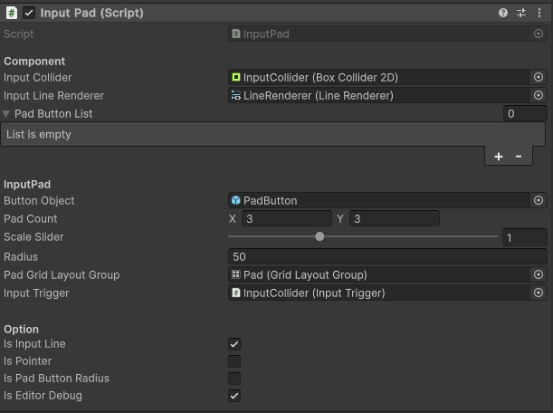

# InputPatternPanel for Unity
 

InputPatternPanel is a library that helps you handle pattern events easily.
* Depending on the input pattern, you can handle the appropriate events.
* It is useful for effectively detecting user input and controlling the behavior of a program or application accordingly.
* It provides a lot of convenience as it can handle various input patterns with simple code.

  

---

Nammu - DreamAntDev  
Email : nammu8395@gmail.com  
GitHub Issue : https://github.com/mod157/ipp.unity/issues  

---
Table of Contents
---
- [InputPatternPanel for Unity](#inputpatternpanel-for-unity)
  - [Table of Contents](#table-of-contents)
  - [History](#history)
  - [Getting started](#getting-started)
  - [UPM package](#upm-package)
  - [License](#license)

History
---
v1.0.0 - Add Package

Getting started
---
asset package(`ipp.unity.*.*.*.unitypackage`) available in [ipp.unity/releases](https://github.com/mod157/ipp.unity/releases) page.

| Title | Name | Context | 
| --- | --- | --- |
| Component | `InputColider` | Responsible for collision detection for input. |
|  | `InputLineRenderer` | Renders a line from input buttons to the current pointer position based on drag state.| 
|  | `PadButtonList` | Manages a list of pad buttons generated synchronously. |
| InputPad | `ButtonObject` | Base button object. |
|  | `PadCount` | Number of rows and columns to generate. | 
|  | `ScaleSlider` | Scale factor for spacing between buttons. |
|  | `Radius` | Recognition range for buttons. | 
|  | `PadGrideLayoutGroup` | Layout for buttons. |
|  | `InputTrigger` |  Handles collision detection events. |
| Option | `IsInputLine` | Enables/disables the InputLineRenderer. |
|  | `IsPointer` | Enables/disables pointer display. | 
|  | `IsPadButtonRadius` | Enables/disables button range for each button. |
|  | `IsEditorDebug` | Enables/disables debug mode. | 

UPM package
---

License
---
This library is under the [MIT](https://github.com/mod157/ipp.unity?tab=MIT-1-ov-file) License.
